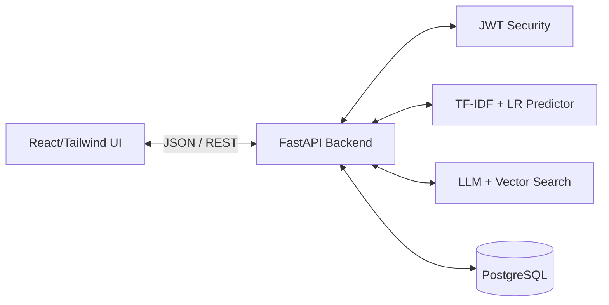

# ⚖️ Smart Karnataka Nyaya

**Smart Karnataka Nyaya** is an AI-driven, multilingual legal tech platform designed to democratize access to justice for the citizens of Karnataka. It bridges the gap between citizens and legal professionals through intelligent advocate matching, machine learning case outcome predictions, and a hallucination-free RAG AI legal chatbot.

---

## 🌟 Key Features

* **🌐 Seamless Multilingual UI:** Full support for toggling between English and Kannada instantly using `i18next`.
* **🤝 Privacy-First Advocate Matching:** Citizens broadcast their cases securely. The system uses a strict constraint algorithm (District + Specialization + Language) to notify only highly relevant, verified advocates.
* **🤖 AI Legal Guidance (RAG Pipeline):** A legal chatbot powered by Retrieval-Augmented Generation. It reads actual Indian laws and precedents from the database before answering, ensuring 100% legal accuracy and zero hallucinations.
* **📈 Case Outcome Predictor (ML):** Uses a Scikit-Learn **Logistic Regression** model and **TF-IDF vectorization** trained on historical Supreme Court data to predict the probability of a case being accepted or rejected.
* **🧮 Dynamic Legal Calculators:** Case-aware rules engines that calculate precise Court Filing Fees and Statute of Limitation periods based on specific legal domains and reliefs.
* **📄 Automated Workspaces:** Features including an Evidence Organizer digital vault and a dynamic Vakalatnama document generator.

---

## 🛠️ Technology Stack

### **Frontend**
* React.js (Single Page Application)
* Vite (Build Tool & Dev Server)
* Tailwind CSS (Responsive UI)
* react-i18next (Localization)
* Axios (API Client)

### **Backend & AI**
* Python 3
* FastAPI (High-performance ASGI framework)
* SQLAlchemy (PostgreSQL ORM)
* Scikit-Learn & Joblib (Machine Learning)
* PyJWT (Stateless Authentication)

### **Database & Deployment**
* PostgreSQL (Relational Data & `pgvector` for AI embeddings)
* Render (Automated CI/CD Cloud Hosting)

---

## 🏗️ System Architecture



---

## 🚀 Local Installation & Setup

Follow these steps to run the project on your local Windows machine.

### 1. Clone the Repository
```bash
git clone https://github.com/jeevotham14/smart_KA_nyaya.git
cd smart_KA_nyaya
```

### 2. Backend Setup (FastAPI)
Open a terminal and navigate to the backend folder:
```bash
cd backend
python -m venv venv
.\venv\Scripts\activate
pip install -r requirements.txt
```
Start the backend server:
```bash
uvicorn app.main:app --reload
```
*(The backend API will run on http://localhost:8000)*

### 3. Frontend Setup (React/Vite)
Open a new, separate terminal and navigate to the frontend folder:
```bash
cd frontend
npm install
npm run dev
```
*(The frontend will run on http://localhost:5173)*

---

## 📂 Project Structure

```text
smart_KA_nyaya/
│
├── backend/                  # FastAPI Python Application
│   ├── app/
│   │   ├── api/routes/       # REST API Endpoints (auth, broadcasts, etc.)
│   │   ├── models/           # SQLAlchemy DB Models
│   │   ├── services/         # Business Logic, ML Inference, Matching Rules
│   │   └── main.py           # FastAPI Entry Point
│   └── requirements.txt      # Python Dependencies
│
└── frontend/                 # React UI Application
    ├── src/
    │   ├── components/       # Reusable UI components (Header, Forms)
    │   ├── pages/            # View Containers (Citizen/Advocate dashboards)
    │   ├── i18n/             # English and Kannada Translation JSONs
    │   └── services/         # Axios network calls
    └── package.json          # Node Dependencies
```

---
*Built for democratizing justice and legal aid in Karnataka.*
